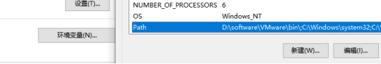

##### 介绍

###### Node.js
http://nodejs.cn/learn/introduction-to-nodejs

类似python有自己的运行环境。

Node.js 是一个开源和跨平台的 JavaScript 运行时环境。 它几乎是任何类型项目的流行工具！

###### Npm

包管理工具，类似python的pip。

npm 以其简单的结构帮助 Node.js 生态系统蓬勃发展，现在 npm 仓库托管了超过 1,000,000 个开源包，你可以自由使用。

##### 下载Node.js安装包

Node.js官网：http://nodejs.cn/
选择或者记住安装的目录。

##### 配置环境变量

默认情况下，安装时会自动加入环境变量，但保险起见还是验证一下。

###### 验证Node.js及相关工具是否被添加至环境变量

Win+R调出运行窗口，输入cmd回车，在控制台依次输入
node -v
npm -v
并回车。如出现版本号，在代表已添加至环境变量。

###### 如何添加至环境变量

右键此电脑打开属性，选择右侧的高级系统设置，点击环境变量，选中系统变量中的Path

点击下面编辑，然后新建，输入Node JS安装目录，依次点击确认，退出系统属性。

##### npm配置

###### 为npm设置淘宝镜像源

npm config set registry http://registry.npm.taobao.org/

###### 设置全部模块下载位置

#全部模块下载位置， 设置为Node JS目录是因为它在环境变量里， 不用额外设置
npm config set prefix “替换为Node JS安装目录”

#npm下载缓存位置
npm config set cache “Node JS安装目录\node_modules_cache”

##### 开发工具

###### VS Code(宇宙最强编辑器，fleet还没出)

https://code.visualstudio.com/
直接下载安装
需要注意的是，它可能需要设置权限。以管理员运行VS Code，打开终端
set-ExecutionPolicy RemoteSigned

###### WebStrom

https://www.jetbrains.com/webstrom/
需要软妹币，或者使用魔法破解，是更为专业的开发工具。